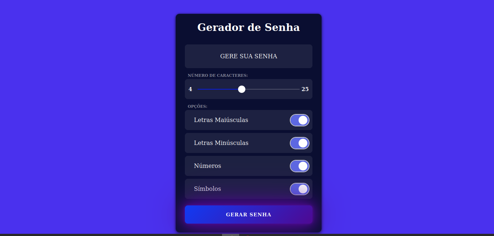

<h1 align="center"> Gerador de Senhas </h1>

  

## 🚀 Tecnologias

Esse projeto foi desenvolvido com as seguintes tecnologias:

- HTML e CSS
- JavaScript
- GitHub

## 💻 Projeto

Um gerador de senhas aleatórias para criar senhas fortes, podendo usar letras maiúsculas, minúsculas, números e caracteres especiais.